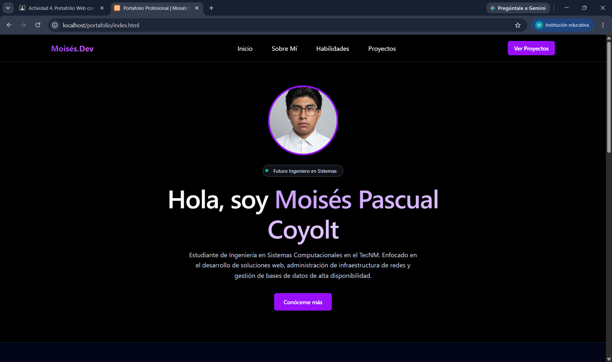

#  Portafolio Profesional de Desarrollo Web

### **Estudiante:** Moisés Pascual Coyolt  
### **Materia:** Programación Web  
### **Institución:** Instituto Tecnológico Nacional de México (TecNM)  
### **Fecha:** Julio 2026

---

##  Descripción del Proyecto
Este proyecto consiste en el diseño, personalización y despliegue de un portafolio web profesional e individual. Está construido utilizando **Tailwind CSS** como framework de estilos base mediante su conexión por CDN, adaptando una estructura limpia y responsiva para exhibir proyectos de ingeniería y habilidades técnicas.

* **Link de descarga de la plantilla original:** Framework base utilizado mediante CDN oficial de Tailwind CSS.

###  Secciones del Portafolio
* **Inicio (Hero Section):** Bienvenida visual con mi foto de perfil profesional, nombre y una breve introducción de mi perfil como estudiante de ingeniería.
* **Sobre Mí:** Descripción detallada de mi trayectoria académica en el TecNM y mis metas profesionales en el área de sistemas.
* **Habilidades (Skills):** Panel visual con iconos informativos que muestra mi dominio y aspiraciones en tecnologías de desarrollo web, redes (Cisco) y bases de datos.
* **Proyectos:** Galería de tarjetas que exhiben trabajos prácticos reales de la materia (como la librería de utilería JS) y proyectos de investigación de arquitectura.

---

## Proceso de Creación (Paso a Paso)

1. **Planificación y Estructura:** Se creó un directorio raíz independiente y se establecieron las subcarpetas requeridas (`css/`, `js/`, `img/`) para cumplir con los estándares de orden del curso.
2. **Integración de Tailwind CSS:** Se configuró el archivo `index.html` enlazando el script del framework Tailwind vía CDN para dar un diseño moderno y responsivo sin archivos locales masivos.
3. **Creación de Archivos Requeridos:** Se generaron los archivos `portafolio.css` y `portafolio.js` vacíos dentro de sus respectivas carpetas para cumplir estrictamente con los lineamientos de la entrega.
4. **Personalización del Contenido:** Se editó el código HTML para plasmar mis datos reales, objetivos profesionales y se integró la fotografía formal en formato digital dentro de la carpeta multimedia.
5. **Simulación de Proyectos:** Se rellenaron las secciones de portafolio con proyectos reales e ideas planificadas enfocadas en el ecosistema de desarrollo de software para mostrar un diseño completo.

---

##  Capturas de Pantalla

---

* **Link de descarga de la plantilla original:** [Tailwind Toolbox - Portfolio Template](https://www.tailwindtoolbox.com/templates/portfolio-template)